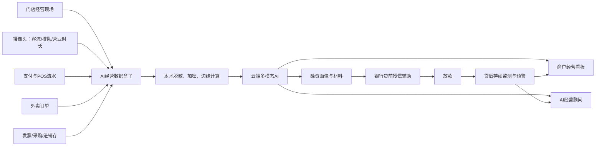
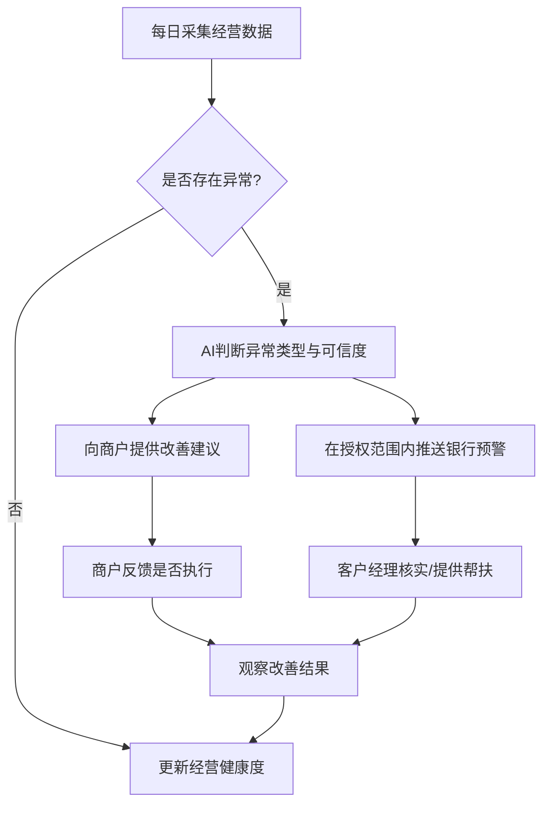

# 普惠商鉴·AI经营数据盒子 PRD

> **版本**：V1.0（工行杯方案稿）  
> **产品定位**：面向小微餐饮商户的“经营数据可信化 + AI经营诊断 + 普惠融资服务”平台。  
> **一句话价值**：帮助小微商户看懂生意、经营生意、证明自己；帮助银行看见真实经营、做出更精准的金融服务决策。

---

## 1. 项目背景

**普惠商鉴**是平台品牌名称；**AI经营数据盒子**是部署于门店的数据采集与边缘处理终端。平台通过“商户经营顾问”和“银行普惠风控中枢”连接商户与金融机构。

### 1.1 典型场景

一家夫妻经营的小餐馆每天都有稳定客流，微信、支付宝、POS 与外卖订单也持续增长；但由于没有专职财务人员，流水、采购、发票和库存数据分散，账目零散且报表不规范。老板说不清利润、现金流和库存占用，银行也难以判断其经营真实性与偿债能力。

这类商户并非没有信用，而是**缺少把真实经营转化为可验证信用的能力**。

### 1.2 核心痛点

| 角色 | 痛点 | 造成的结果 |
|---|---|---|
| 商户 | 不会做账、不会看报表，不清楚赚钱与否 | 决策依赖经验，库存和现金流容易失控 |
| 商户 | 经营数据分散在支付、外卖、POS、采购等系统 | 贷款材料准备难，难以证明真实经营 |
| 银行客户经理 | 尽调需收集大量纸质或截图材料 | 单户服务成本高、效率低 |
| 银行风控 | 缺少连续、交叉验证的经营数据 | 授信保守，难以精准识别优质商户 |
| 银行贷后团队 | 放款后只看到还款结果，缺少经营过程信号 | 风险发现滞后，帮扶措施不足 |

### 1.3 机会与类比

门店的交易流水、客流、库存和成本变化，类似于资本市场中的成交量、资金流与价格趋势：单一指标容易失真，多维度连续信号的交叉验证更能体现真实状态。

但产品表达应使用“**经营健康度与现金流管理**”，而非股票交易术语。AI经营顾问的作用类似风险管理助手：不是替商户做决定，而是识别经营波动并建议合理的“资金配置、库存配置与融资节奏”。

---

## 2. 产品目标与边界

### 2.1 产品目标

1. 将零散经营行为沉淀为可信、连续、标准化的经营数据资产。
2. 让商户在3分钟内看懂当日经营，获得可执行的改善建议。
3. 为银行提供经商户授权的经营画像、融资材料与风险信号。
4. 构建“贷前识别—贷中服务—贷后预警”的普惠金融闭环。

### 2.2 非目标（MVP不做）

- 不直接替代银行信贷审批、定价或授信决策；
- 不做顾客身份识别、人脸识别或顾客画像；
- 不替代完整ERP、财务软件或收银系统；
- 不直接代替商户执行采购、定价、促销等经营动作；
- 不在未授权情况下向银行开放门店数据。

### 2.3 首期适用范围

首期聚焦：夫妻店、小餐馆、快餐店、社区餐饮等有线下客流、电子支付和基础交易记录的商户；后续再扩展至便利店、零售店和生活服务业。

---

## 3. 用户与使用场景

### 3.1 用户画像

| 用户 | 典型特征 | 核心任务 |
|---|---|---|
| 餐饮老板 | 无专职财务，日常忙于采购、出餐、收银 | 看经营、控成本、管库存、申请融资 |
| 店长/家属 | 负责收银、排班、进货或外卖运营 | 查看当日异常、执行经营建议 |
| 银行客户经理 | 服务多个小微商户 | 快速了解经营、邀约及辅助尽调 |
| 银行风控人员 | 负责准入、授信、贷后管理 | 评估可信度、识别风险变化 |

### 3.2 关键用户故事

- 作为餐馆老板，我希望每天自动看到收入、客流、成本、库存和现金流，而不必手工做账。
- 作为餐馆老板，我希望知道“今天应该做什么”，例如减少哪种食材、推出什么套餐、何时申请周转资金。
- 作为客户经理，我希望在商户授权后快速判断其经营是否真实、是否稳定、是否有融资需求。
- 作为风控人员，我希望看到连续的经营趋势与异常原因，而不是只看到某一张流水截图。

---

## 4. 产品全景与业务闭环



### 4.1 端到端流程

```mermaid
sequenceDiagram
    participant M as 商户
    participant Box as 数据盒子
    participant AI as 云端AI
    participant Bank as 工行平台
    M->>Box: 安装设备并授权数据
    Box->>Box: 采集、脱敏、加密
    Box->>AI: 上传经营特征及授权数据
    AI->>AI: 多源交叉验证、生成画像
    AI-->>M: 报表、现金流预测、经营建议
    M->>Bank: 发起融资申请并授权查看画像
    AI-->>Bank: 经营摘要、可信度、风险信号
    Bank-->>M: 授信结果/金融产品建议
    AI-->>M: 放款后持续经营建议
    AI-->>Bank: 贷后预警（仅授权范围内）
```

---

## 5. 功能需求

## 5.1 数据采集与本地数据盒子

### 功能说明

数据盒子部署在门店，负责连接设备与经营系统，并优先在本地完成敏感信息处理。

| 编号 | 功能 | 需求说明 | 优先级 |
|---|---|---|---|
| DH-01 | 客流识别 | 统计进店/离店人数、排队人数、排队时长、营业状态、桌位使用率 | P0 |
| DH-02 | 支付流水接入 | 接入微信、支付宝、POS的交易金额、时间、退款、支付渠道等字段 | P0 |
| DH-03 | 外卖订单接入 | 接入订单数、金额、商品、配送费、满减、取消和退款等数据 | P0 |
| DH-04 | 发票与采购凭证 | 支持拍照/OCR上传、电子发票导入及采购单录入 | P1 |
| DH-05 | 进销存接入 | 对接已有进销存系统；无系统时提供简易采购、库存和损耗录入 | P1 |
| DH-06 | 本地脱敏 | 默认不上传人脸、支付账号、手机号、收款方完整身份信息 | P0 |
| DH-07 | 离线缓存 | 网络中断时本地加密缓存，恢复网络后断点续传 | P0 |
| DH-08 | 设备健康监测 | 监测网络、摄像头、数据源连接与存储状态 | P0 |

### 摄像头数据边界

摄像头仅生成门店经营特征，不上传可识别个人身份的原始顾客影像；默认不保存人脸模板、不进行人脸比对、不推断顾客个人属性。

---

## 5.2 经营数据标准化与可信度引擎

### 经营数据统一模型

| 数据域 | 核心字段 | 更新频率 |
|---|---|---|
| 交易 | 交易时间、金额、渠道、退款、订单号 | 实时/小时级 |
| 客流 | 进店人数、排队时长、营业时长、桌位使用率 | 分钟级/小时级 |
| 外卖 | 订单、实收、满减、配送费、评分、退款 | 小时级/日级 |
| 采购 | 食材名称、数量、单价、供应商、采购日期 | 日级/录入即更新 |
| 库存 | 入库、出库、盘点、损耗、临期情况 | 日级 |
| 发票 | 销售/采购类别、金额、日期、验真状态 | 日级 |

### 多源交叉验证规则

| 规则 | 识别信号 | 处理方式 |
|---|---|---|
| 客流升、收款未升 | 转化率下降、漏单或收银数据缺失 | 提示核查收银与服务效率 |
| 收款升、客流不变 | 客单价提升、外卖增量或异常流水 | 拆分渠道并验证订单来源 |
| 销售升、采购和库存无变化 | 库存录入缺失或数据异常 | 标记可信度下降，提醒补录 |
| 外卖升、堂食降 | 渠道迁移 | 分析外卖毛利与配送成本 |
| 长时间无客流、无交易 | 停业、设备离线或异常经营 | 触发设备/经营状态核验 |

### 数据可信度评分

可信度评分范围为0—100，仅作为数据质量及经营核验辅助，不作为单独授信结论。

```text
可信度评分 = 数据完整性 × 30%
           + 多源一致性 × 30%
           + 流水连续性 × 20%
           + 设备在线率 × 10%
           + 异常数据健康度 × 10%
```

---

## 5.3 商户端：经营看板

### 页面原型一：商户首页 / 今日经营


```text
┌───────────────────────────────────────────┐
│  AI经营助手                         09月13日 │
│  王记家常菜 · 营业中  ● 数据正常             │
├───────────────────────────────────────────┤
│  今日实收 ¥8,560      较昨日 +12.4%         │
│  ───────────────────────────────────────  │
│  订单 286      客流 318      客单价 ¥29.9   │
├───────────────────────────────────────────┤
│  [营收趋势]                                │
│  ¥10k ┤                         ●           │
│   ¥5k ┤              ●      ●               │
│     0 └── 10  11  12  13  14  15  16  17时   │
├───────────────────────────────────────────┤
│  今日关注                                   │
│  ⚠ 午间客流高，客单价较同类时段低 11%         │
│  ✓ 叶菜库存可支撑 2.1 天，处于合理区间         │
├───────────────────────────────────────────┤
│  [经营报告]       [问AI]       [融资服务]     │
└───────────────────────────────────────────┘
```

### 功能需求

| 编号 | 功能 | 需求说明 | 优先级 |
|---|---|---|---|
| MB-01 | 今日总览 | 展示实收、订单、客流、客单价、退款率及同比/环比 | P0 |
| MB-02 | 时段趋势 | 按小时展示客流、订单、营收及排队趋势 | P0 |
| MB-03 | 经营提醒 | 每日输出不超过3条优先级最高的经营提醒 | P0 |
| MB-04 | 数据状态 | 显示支付、外卖、摄像头、库存等数据源连接状态 | P0 |
| MB-05 | 历史对比 | 支持日、周、月、节假日同期对比 | P1 |

### 关键交互

- 首页打开后默认展示“今天”；点击任一指标进入对应分析页。
- 异常卡片必须说明“发现了什么、可能原因、建议操作”。
- 商户可标记建议为“已执行”“暂不适用”“我有疑问”，形成AI建议反馈闭环。

---

## 5.4 商户端：AI经营顾问

### 页面原型二：AI经营建议


```text
┌───────────────────────────────────────────┐
│  ← AI经营顾问                              │
│  本周优先处理 2 件事                        │
├───────────────────────────────────────────┤
│  ① 提升午间客单价                    高优先级 │
│  发现：11:30—13:00客流占全天42%，             │
│       客单价比晚间低¥6.8。                    │
│  建议：上线“主食+小菜+饮品”午市套餐，          │
│       饮品采用加价购。                        │
│  预估：若转化率达到15%，周增收约¥1,100。       │
│  [查看依据] [标记已执行]                     │
├───────────────────────────────────────────┤
│  ② 控制叶菜采购量                    中优先级 │
│  发现：叶菜周转天数从2.4天升至4.8天。          │
│  建议：未来3天采购量下调20%，优先消化库存。     │
│  预期：释放约¥680现金占用，降低损耗。           │
│  [查看依据] [稍后处理]                       │
├───────────────────────────────────────────┤
│  你可以问：为什么本周利润下降？                │
│  ┌───────────────────────┐ [发送]           │
│  └───────────────────────┘                  │
└───────────────────────────────────────────┘
```

### AI建议生成规范

每条建议必须包括：

1. **发现**：明确异常或机会，包含关键指标和时间范围；
2. **依据**：展示关联数据，例如“客流上涨但客单价下降”；
3. **行动**：不超过3个可执行动作；
4. **预期**：预估对营收、利润、库存或现金流的影响范围；
5. **风险提示**：说明适用条件和可能的副作用；
6. **反馈入口**：供商户记录执行情况，优化后续建议。

| 编号 | 功能 | 需求说明 | 优先级 |
|---|---|---|---|
| AC-01 | 主动建议 | 基于异常、趋势与目标生成日/周经营建议 | P0 |
| AC-02 | 问答分析 | 支持商户以自然语言追问“为什么利润下降” | P1 |
| AC-03 | 建议解释 | 展示建议引用的经营数据、时间范围与计算依据 | P0 |
| AC-04 | 方案模拟 | 展示套餐、采购量或营业时段调整后的预估结果 | P1 |
| AC-05 | 采纳反馈 | 支持已执行、暂不适用、效果反馈 | P1 |

### 建议优先级规则

| 优先级 | 触发条件 | 示例 |
|---|---|---|
| 高 | 影响现金流、重大成本或潜在经营风险 | 库存临期、连续营收下滑、现金缺口 |
| 中 | 影响利润率或运营效率 | 客单价下降、外卖毛利变低、排队过长 |
| 低 | 增长机会或优化建议 | 菜品组合优化、会员促销、营业时段微调 |

---

## 5.5 商户端：融资服务

### 页面原型三：融资画像与申请


```text
┌───────────────────────────────────────────┐
│  ← 融资服务                                │
│  经营健康度 82 / 100             良好        │
│  数据可信度 91 / 100             较高        │
├───────────────────────────────────────────┤
│  融资准备度                                 │
│  ✓ 连续经营数据：12个月                     │
│  ✓ 月均经营性现金流：¥32,400                 │
│  ✓ 收入趋势：稳定增长                        │
│  ! 建议补充：近3个月采购发票                 │
├───────────────────────────────────────────┤
│  可参考的资金需求                            │
│  日常周转：¥5万—¥10万                         │
│  适用：食材采购、旺季备货、短期现金周转        │
│  [生成融资材料]  [咨询客户经理]               │
├───────────────────────────────────────────┤
│  数据授权                                    │
│  已授权：经营摘要、趋势与风险提示             │
│  未授权：原始交易明细、原始视频               │
│  [管理授权范围]                              │
└───────────────────────────────────────────┘
```

| 编号 | 功能 | 需求说明 | 优先级 |
|---|---|---|---|
| FS-01 | 经营健康度 | 汇总营收稳定性、利润、库存、现金流和经营活跃度 | P0 |
| FS-02 | 数据可信度 | 展示数据质量评分、扣分项和补充建议 | P0 |
| FS-03 | 融资准备度 | 提示已有材料、缺失材料与可改善项 | P0 |
| FS-04 | 融资材料生成 | 自动生成经营摘要、现金流预测、经营证明和材料清单 | P0 |
| FS-05 | 授权管理 | 可按数据类型、用途、有效期管理银行访问授权 | P0 |
| FS-06 | 产品匹配 | 基于资金用途和经营状态推荐适配金融产品 | P1 |

### 融资画像字段

| 模块 | 输出内容 |
|---|---|
| 基础经营 | 行业、营业时长、经营年限、门店规模、渠道结构 |
| 经营规模 | 近6/12个月营收、订单、客流、客单价趋势 |
| 经营效率 | 毛利估算、成本率、库存周转、退款率、排队效率 |
| 现金流与还款能力 | 经营性净现金流、波动区间、未来30天预测 |
| 可信度 | 数据完整性、多源一致性、设备在线率、异常提示 |
| 风险与改善 | 主要风险信号、商户已执行的改善动作、AI建议 |

---

## 5.6 银行端：商户经营画像

### 页面原型四：银行客户经理工作台


```text
┌─────────────────────────────────────────────────────────────┐
│  工行普惠金融 · 商户经营洞察                                  │
│  商户：王记家常菜   授权有效至：2026-12-31  数据可信度：91      │
├──────────────┬──────────────────────────────────────────────┤
│ 商户摘要      │ 近6个月经营趋势                               │
│ 行业：餐饮    │ 营收  ▁▂▃▃▄▅   客流  ▁▂▂▃▄▅                  │
│ 经营：3.2年   │ 月均实收：¥25.8万   环比：+8.6%               │
│ 营业：11h/日  │ 月均经营性现金流：¥3.24万                     │
│              ├──────────────────────────────────────────────┤
│ 风险信号      │ 经营核验                                      │
│ ● 低风险      │ ✓ 客流、交易、订单趋势一致                    │
│ 近30日无重大  │ ✓ 支付流水连续，设备在线率98.7%               │
│ 异常          │ ! 采购发票完整度72%，建议补充                 │
│              ├──────────────────────────────────────────────┤
│ [查看材料]    │ 建议动作                                      │
│ [联系商户]    │ 适合进入授信评估；建议额度仅供审批辅助参考     │
└──────────────┴──────────────────────────────────────────────┘
```

### 银行端功能需求

| 编号 | 功能 | 需求说明 | 优先级 |
|---|---|---|---|
| BK-01 | 商户列表 | 按行业、区域、融资需求、风险等级、数据可信度筛选 | P0 |
| BK-02 | 经营画像 | 展示授权范围内的商户经营摘要、趋势及可信度 | P0 |
| BK-03 | 交叉核验 | 呈现客流、交易、订单、采购与库存间的一致性结论 | P0 |
| BK-04 | 授信辅助 | 展示建议关注项、材料缺口和建议授信区间，仅供人工决策参考 | P0 |
| BK-05 | 材料导出 | 生成标准化尽调摘要与融资材料包 | P1 |
| BK-06 | 客户经理协同 | 支持记录跟进、联系商户、发起补充材料请求 | P1 |

---

## 5.7 网页端：商户经营总览与贷后预警中心

网页端适合商户老板在电脑上进行周/月经营复盘，也适合银行客户经理和风控人员进行多商户管理、资料审核及贷后监测。移动端突出“快速看数、立即行动”，网页端突出“全局分析、横向对比和协同处理”。

### 页面原型五：商户网页端 / 经营总览


| 编号 | 功能 | 需求说明 | 优先级 |
|---|---|---|---|
| WB-01 | 多周期经营复盘 | 支持日、周、月和自定义时间段的营收、客流、订单、客单价趋势查看 | P0 |
| WB-02 | 多维经营分析 | 在同一页面联动查看渠道收入、时段表现、菜品/品类贡献、库存成本及现金流预测 | P0 |
| WB-03 | AI待办中心 | 集中展示高、中、低优先级建议，以及商户的采纳和效果反馈 | P1 |
| WB-04 | 报表导出 | 支持导出经营日报、周报、月报和融资材料预览 | P1 |

### 页面原型六：银行网页端 / 贷后预警中心


| 编号 | 功能 | 需求说明 | 优先级 |
|---|---|---|---|
| WB-05 | 风险概览 | 汇总所辖商户数、各级预警数量、待处理事项和趋势变化 | P0 |
| WB-06 | 预警商户列表 | 支持按预警级别、行业、区域、客户经理和触发信号筛选排序 | P0 |
| WB-07 | 预警详情 | 展示触发依据、经营趋势、多源核验结果、历史预警及建议动作 | P0 |
| WB-08 | 处置留痕 | 支持发起核验、联系客户经理、记录回访结论和关闭预警 | P0 |
| WB-09 | 商户帮扶建议 | 预警详情中同步展示可向商户提供的经营改善建议 | P1 |

---

## 5.8 银行端：贷后监测与预警

### 预警分级

| 级别 | 触发样例 | 银行建议动作 | 商户侧同步建议 |
|---|---|---|---|
| 黄色 | 连续两周营收或客流下降；库存周转变慢 | 客户经理关注、核实原因 | 调整备货、观察客流变化 |
| 橙色 | 交易明显下滑；退款率异常；成本快速上升 | 发起经营回访、补充分析 | 控制成本、优化促销、保障现金流 |
| 红色 | 持续无交易；停业迹象；严重现金流缺口 | 风控介入、启动人工核验 | 提示商户联系客户经理并制定恢复计划 |

### 贷后闭环



---

## 6. 核心指标与计算口径

| 指标 | 口径 | 用途 |
|---|---|---|
| 日实收 | 支付、POS、外卖等渠道实收之和，扣除退款 | 经营规模 |
| 客单价 | 实收金额 ÷ 有效订单数 | 定价与套餐优化 |
| 客流转化率 | 有效交易订单数 ÷ 进店客流 | 服务与销售效率 |
| 毛利率（估算） | （销售额－食材及直接成本）÷ 销售额 | 盈利能力 |
| 库存周转天数 | 平均库存成本 ÷ 日均销售成本 | 库存效率与现金占用 |
| 经营性现金流 | 营业收入流入－采购、人工、租金等经营支出 | 偿债能力辅助判断 |
| 营收稳定性 | 按周/月营收波动、趋势、季节性综合计算 | 授信及风险辅助 |
| 数据可信度 | 完整性、一致性、连续性、设备在线率、异常率加权 | 数据质量辅助 |

---

## 7. AI能力设计

### 7.1 AI输入、推理与输出

| 环节 | 内容 |
|---|---|
| 输入 | 客流、排队、营业时长、交易、订单、采购、库存、发票等脱敏数据 |
| 分析 | 时间序列趋势、异常检测、多源一致性验证、行业基准对比、现金流预测 |
| 输出 | 经营报表、问题诊断、行动建议、融资材料、贷后预警 |
| 人工约束 | 经营建议由商户自主选择；融资及授信结论必须由银行人工审批 |

### 7.2 AI建议模板

```text
【问题】午间客单价低于近四周均值11%
【依据】11:30—13:00客流占全天42%，但套餐购买率仅18%
【建议】推出高毛利套餐；设置饮品加价购；在点餐页优先展示套餐
【预期】在不降低客流的前提下，客单价提升3%—6%
【注意】活动上线后观察7天，若退款率或差评上升，及时调整
```

### 7.3 建议质量要求

- 不得只输出“提高销量”“降低成本”等空泛结论；
- 不得将相关性直接表述为因果关系；
- 对数据不足或可信度低的结论，必须标记“建议补充数据后判断”；
- 对融资、还款等金融事项，只能做匹配与风险提示，不得承诺授信结果；
- 每条建议都应可追溯到数据来源、时间范围和触发规则。

---

## 8. 权限、隐私与合规

### 8.1 权限原则

1. 商户知情、明确授权、可随时查看与管理授权；
2. 最小必要原则：银行默认查看经营摘要，不默认查看原始明细；
3. 摄像头只统计经营活跃度，不采集或传输顾客可识别信息；
4. 数据本地脱敏、传输加密、云端分级存储；
5. 全量记录数据访问、导出与授权变更日志。

### 8.2 数据分级

| 数据级别 | 示例 | 默认处理 |
|---|---|---|
| 一级：经营摘要 | 月营收、客流趋势、库存周转、风险标签 | 经商户授权后可供银行查看 |
| 二级：经营明细 | 按日渠道流水、订单结构、采购明细 | 需单独授权、按用途和有效期控制 |
| 三级：敏感原始数据 | 顾客影像、完整支付账号、联系方式 | 默认不采集或仅本地处理，不向银行提供 |

---

## 9. 非功能需求

| 类别 | 要求 |
|---|---|
| 易用性 | 商户端核心页面适配手机；首次上手无需财务知识 |
| 时效性 | 营收、客流等核心指标小时级更新；日结报表次日10:00前生成 |
| 稳定性 | 数据盒子网络中断可本地缓存，恢复后自动续传 |
| 安全性 | 本地与云端加密；权限分级；关键操作留痕 |
| 可解释性 | 经营建议、风险预警、评分均展示主要依据 |
| 可扩展性 | 支持后续接入更多支付渠道、ERP、银行产品与行业模型 |

---

## 10. MVP版本规划

| 阶段 | 目标 | 核心交付 |
|---|---|---|
| V1：看得见 | 建立基础经营数据闭环 | 数据盒子、支付/POS/外卖接入、客流统计、经营看板 |
| V2：看得懂 | 输出可解释的经营洞察 | 成本库存录入、经营报告、异常检测、AI经营建议 |
| V3：贷得到 | 打通融资服务流程 | 融资画像、材料生成、银行画像工作台、授权管理 |
| V4：经营得更好 | 建立贷后陪伴闭环 | 现金流预测、贷后监测、风险预警、建议效果追踪 |

---

## 11. 成功衡量指标

| 维度 | 指标 | 首期目标示例 |
|---|---|---|
| 商户覆盖 | 数据盒子激活率 | ≥ 85% |
| 数据质量 | 核心数据源接入完成率 | ≥ 80% |
| 使用价值 | 周经营报告查看率 | ≥ 60% |
| 建议价值 | AI建议采纳率 | ≥ 25% |
| 融资效率 | 商户尽调材料准备时长 | 较传统流程缩短50% |
| 风控价值 | 预警提前识别天数 | 较还款逾期前提前14天以上 |
| 经营改善 | 接入商户库存周转改善率 | 试点商户平均改善10%以上 |

---

## 12. 项目亮点（工行杯答辩可直接使用）

1. **从“看流水”到“看经营”**：以客流、交易、订单、库存、发票等多模态数据构建真实经营画像。
2. **从“人工报表”到“AI经营顾问”**：不仅呈现经营结果，还给出可解释、可执行、可评估的改善动作。
3. **从“贷前一次评估”到“全周期经营陪伴”**：覆盖贷前识别、贷中服务、贷后预警与商户帮扶。
4. **从“抵押物导向”到“经营数据授信”**：让原本难以被金融服务覆盖的真实经营能力得到识别。
5. **兼顾金融效率与数据安全**：本地脱敏、最小授权、数据分级和全过程留痕，降低隐私与合规风险。

## 13. 待确认事项

- 首期是否只接入工行收单流水，还是同时接入微信、支付宝和第三方POS？
- 摄像头是否由银行/合作方统一提供，还是支持接入现有设备？
- 融资材料是否需要与工行现有普惠贷款产品及审批系统打通？
- 首期试点是否限定某个城市、某类餐饮商户或某个支行？
- “建议授信区间”采用规则引擎、评分模型，还是仅作为客户经理参考信息？
