# 普惠商鉴·AI经营数据盒子 PRD

> **版本**：V1.1（工行杯方案优化稿）
> **产品定位**：以可信经营数据为基础、以AI经营改善为驱动的小微企业普惠金融服务平台。
> **一句话价值**：让真实经营被看见、被验证、被服务；让经营改善成为小微企业获得更好金融服务的起点。

---

## 1. 项目背景

**普惠商鉴**是平台品牌名称；**AI经营数据盒子**是部署于门店的数据采集与边缘处理终端。平台通过“商户经营顾问”和“银行普惠风控中枢”连接商户与金融机构。

### 1.1 典型场景

一家夫妻经营的小餐馆每天都有稳定客流，微信、支付宝、POS 与外卖订单也持续增长；但由于没有专职财务人员，流水、采购、发票和库存数据分散，账目零散且报表不规范。老板说不清利润、现金流和库存占用，银行也难以判断其经营真实性与偿债能力。

这类商户并非没有信用，而是**缺少把真实经营转化为可验证信用的能力**。

### 1.2 核心痛点

| 角色 | 痛点 | 造成的结果 |
|---|---|---|
| 商户 | 不会做账、不会看报表，不清楚赚钱与否 | 决策依赖经验，库存和现金流容易失控 |
| 商户 | 经营数据分散在支付、外卖、POS、采购等系统 | 贷款材料准备难，难以证明真实经营 |
| 银行客户经理 | 尽调需收集大量纸质或截图材料 | 单户服务成本高、效率低 |
| 银行风控 | 缺少连续、交叉验证的经营数据 | 授信保守，难以精准识别优质商户 |
| 银行贷后团队 | 放款后只看到还款结果，缺少经营过程信号 | 风险发现滞后，帮扶措施不足 |

### 1.3 核心命题

普惠商鉴解决的不是“商户没有数据”，而是“商户的真实经营数据无法成为银行可用的信用依据”。产品将支付流水、客流、订单、采购与库存等经营信号进行交叉验证，形成可解释、可授权、可持续更新的**可信经营证明**。

```text
真实经营数据
→ 可信经营画像
→ 精准融资服务
→ AI经营改善
→ 还款能力增强
→ 动态普惠金融服务
```

### 1.4 差异化定位

| 常见方案 | 普惠商鉴的差异 |
|---|---|
| 仅看支付流水 | 用客流、交易、订单、采购/库存信号验证流水背后的真实经营。 |
| 单次贷前尽调 | 建立贷前识别、贷中陪伴、贷后预警与改善反馈的连续闭环。 |
| 通用AI经营问答 | 输出“数据依据—行动建议—预期收益—结果验证”的可追溯建议。 |
| 只做风险监控 | 将风险预警转化为商户可执行的经营帮扶，提升还款能力。 |

---

## 2. 产品目标与边界

### 2.1 产品目标

1. 将零散经营行为沉淀为可验证、可授权、可持续更新的可信经营数据资产。
2. 让商户在3分钟内看懂当日经营，并获得可执行、可复盘的改善建议。
3. 为银行提供“经营真实性 + 经营稳定性 + 现金流趋势”的辅助判断，而非单一流水截图。
4. 构建“贷前可信识别—贷中经营陪伴—贷后预警帮扶—动态复评”的普惠金融闭环。

### 2.2 非目标（MVP不做）

- 不直接替代银行信贷审批、定价或授信决策；
- 不做顾客身份识别、人脸识别或顾客画像；
- 不替代完整ERP、财务软件或收银系统；
- 不直接代替商户执行采购、定价、促销等经营动作；
- 不在未授权情况下向银行开放门店数据。
- 不将数据可信度、经营健康度或AI建议直接作为自动审批、拒贷或定价依据。

### 2.3 首期适用范围

首期聚焦夫妻店、小餐馆、快餐店、社区餐饮等有线下客流、电子支付和基础交易记录的商户；首批试点应优先选择已有工行收单关系、经营满12个月、愿意授权数据的餐饮商户。

### 2.4 MVP收敛原则

首期必须先证明“经营数据可信、银行能够使用”，而非一次性建设完整ERP。因此，MVP只围绕一套最小可信数据组合展开。

| 范围 | V1必须具备 | V1不做 / 后续迭代 |
|---|---|---|
| 交易数据 | 工行收单/POS流水；可选接入商户授权的微信、支付宝汇总数据 | 全量接入所有第三方收单机构原始明细 |
| 线下经营 | 客流、营业状态、营业时长 | 人脸识别、顾客标签、复杂桌位行为分析 |
| 订单数据 | 1—2家主流外卖渠道订单汇总 | 全外卖平台深度经营系统改造 |
| AI能力 | 可信度核验、异常提示、3类高频经营建议 | 全自动定价、自动采购、代替经营决策 |
| 银行服务 | 融资准备度、经营摘要、补件清单、贷后预警 | 自动审批、自动授信、自动贷后处置 |

---

## 3. 用户与使用场景

### 3.1 用户画像

| 用户 | 典型特征 | 核心任务 |
|---|---|---|
| 餐饮老板 | 无专职财务，日常忙于采购、出餐、收银 | 看经营、控成本、管库存、申请融资 |
| 店长/家属 | 负责收银、排班、进货或外卖运营 | 查看当日异常、执行经营建议 |
| 银行客户经理 | 服务多个小微商户 | 快速了解经营、邀约及辅助尽调 |
| 银行风控人员 | 负责准入、授信、贷后管理 | 评估可信度、识别风险变化 |

### 3.2 关键用户故事

- 作为餐馆老板，我希望每天自动看到收入、客流、成本、库存和现金流，而不必手工做账。
- 作为餐馆老板，我希望知道“今天应该做什么”，例如减少哪种食材、推出什么套餐、何时申请周转资金。
- 作为客户经理，我希望在商户授权后快速判断其经营是否真实、是否稳定、是否有融资需求。
- 作为风控人员，我希望看到连续的经营趋势与异常原因，而不是只看到某一张流水截图。

### 3.3 三方价值闭环

| 参与方 | 获得的价值 | 在闭环中的行为 |
|---|---|---|
| 小微商户 | 看懂经营、改善现金流、降低融资材料准备成本、获得更匹配的服务 | 授权可信经营数据、采纳建议并反馈效果 |
| 工行客户经理/风控 | 缩短尽调、识别真实经营、提前发现风险、形成帮扶抓手 | 使用画像、补件、回访、处置预警与动态复评 |
| 平台/合作方 | 沉淀行业经营模型，形成可复制的数字化普惠服务能力 | 提供设备运维、数据治理、模型与系统服务 |

---

## 4. 产品全景与业务闭环

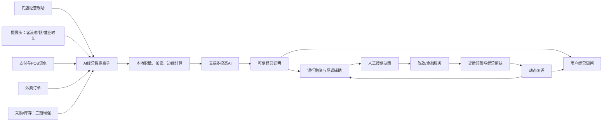

### 4.1 端到端流程

```mermaid
sequenceDiagram
    participant M as 商户
    participant Box as 数据盒子
    participant AI as 云端AI
    participant Bank as 工行平台
    M->>Box: 安装设备并授权数据
    Box->>Box: 采集、脱敏、加密
    Box->>AI: 上传经营特征及授权数据
    AI->>AI: 多源交叉验证、生成可信经营证明
    AI-->>M: 报表、经营建议与融资准备度
    M->>Bank: 发起融资申请并授权查看画像
    AI-->>Bank: 经营摘要、可信度、风险信号
    Bank-->>M: 人工审批结果/适配金融服务
    AI-->>M: 放款后经营改善建议
    AI-->>Bank: 预警、回访线索与动态复评（仅授权范围内）
```

---

## 5. 功能需求

### 5.0 页面原型总览

本PRD共包含10张高保真原型，覆盖商户开通、经营分析、融资服务、银行贷前与贷后管理的完整链路。

| 序号 | 端 | 页面 | 核心任务 |
|---|---|---|---|
| 01 | 商户移动端 | 接入与授权 | 完成设备、数据源与隐私授权开通 |
| 02 | 商户移动端 | 今日经营 | 快速看收入、客流、订单和经营提醒 |
| 03 | 商户移动端 | AI经营顾问 | 查看建议依据、执行动作与效果反馈 |
| 04 | 商户移动端 | 融资服务 | 评估融资准备度、查看经营健康度与管理授权 |
| 05 | 商户移动端 | 融资材料包 | 确认对外共享范围并生成材料 |
| 06 | 商户网页端 | 经营总览 | 进行周/月经营复盘与多维分析 |
| 07 | 银行网页端 | 商户服务工作台 | 筛选高价值商户线索并进行客户经理协同 |
| 08 | 银行网页端 | 商户经营画像 | 查看经营趋势、材料缺口和尽调辅助信息 |
| 09 | 银行网页端 | 可信经营证明 | 查看多源交叉核验和数据使用边界 |
| 10 | 银行网页端 | 贷后预警中心 | 处理预警、核验、帮扶与动态复评 |

## 5.1 数据采集与本地数据盒子

### 功能说明

数据盒子部署在门店，负责连接设备与经营系统，并优先在本地完成敏感信息处理。

| 编号 | 功能 | 需求说明 | 优先级 |
|---|---|---|---|
| DH-01 | 客流识别 | 统计进店/离店人数、排队人数、排队时长、营业状态、桌位使用率 | P0 |
| DH-02 | 工行收单/POS接入 | 接入工行收单或POS的交易金额、时间、退款、支付渠道等字段，作为V1核心交易来源 | P0 |
| DH-03 | 商户授权交易汇总 | 支持微信、支付宝等渠道授权后的日/小时级汇总，用于补全经营规模与趋势 | P1 |
| DH-04 | 外卖订单接入 | V1接入1—2家主流渠道的订单数、实收、退款和满减汇总 | P0 |
| DH-05 | 发票、采购与库存 | 支持拍照/OCR上传、电子发票导入及简易采购、库存录入 | P1 |
| DH-06 | 本地脱敏 | 默认不上传人脸、支付账号、手机号、收款方完整身份信息 | P0 |
| DH-07 | 离线缓存 | 网络中断时本地加密缓存，恢复网络后断点续传 | P0 |
| DH-08 | 设备健康监测 | 监测网络、摄像头、数据源连接与存储状态 | P0 |

### 摄像头数据边界

摄像头仅生成门店经营特征，不上传可识别个人身份的原始顾客影像；默认不保存人脸模板、不进行人脸比对、不推断顾客个人属性。

### 数据最小化原则

- 原始视频默认仅在门店侧短暂处理，云端只接收客流、排队、营业状态等结构化特征；
- 银行默认只见经营摘要和风险信号，按日交易或采购明细需单独、限时授权；
- 商户撤回授权后，银行端立即停止新数据访问；历史访问保留合规审计日志；
- 数据盒子离线时只缓存加密数据，恢复连接后断点续传。

### 页面原型：商户接入与授权

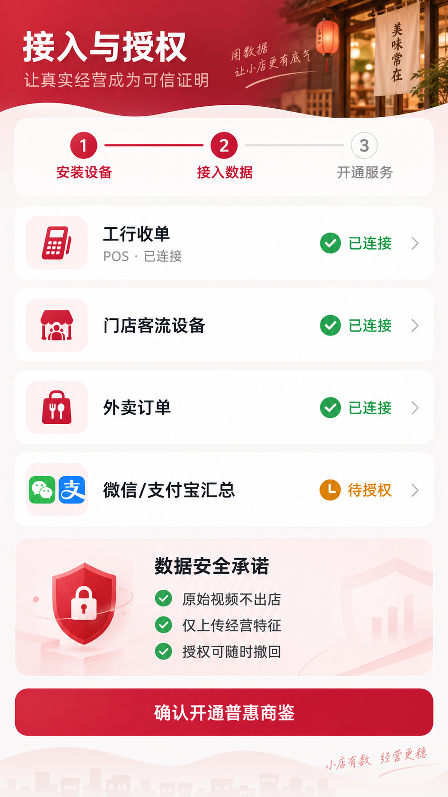

| 编号 | 功能 | 需求说明 | 优先级 |
|---|---|---|---|
| ON-01 | 开通引导 | 以“安装设备—接入数据—开通服务”三步完成首次开通，展示当前进度 | P0 |
| ON-02 | 数据源状态 | 显示工行收单/POS、客流设备、外卖及其他授权数据的连接状态 | P0 |
| ON-03 | 授权说明 | 在开通前明确展示数据用途、授权范围、有效期及撤回方式 | P0 |
| ON-04 | 隐私承诺 | 明确告知“原始视频不出店、仅上传经营特征、授权可撤回” | P0 |
| ON-05 | 异常补救 | 数据源接入失败时，提供重试、联系服务人员或跳过后补充入口 | P1 |

---

## 5.2 经营数据标准化与可信度引擎

### 经营数据统一模型

| 数据域 | 核心字段 | 更新频率 |
|---|---|---|
| 交易 | 交易时间、金额、渠道、退款、订单号 | 实时/小时级 |
| 客流 | 进店人数、排队时长、营业时长、桌位使用率 | 分钟级/小时级 |
| 外卖 | 订单、实收、满减、配送费、评分、退款 | 小时级/日级 |
| 采购 | 食材名称、数量、单价、供应商、采购日期 | 日级/录入即更新 |
| 库存 | 入库、出库、盘点、损耗、临期情况 | 日级 |
| 发票 | 销售/采购类别、金额、日期、验真状态 | 日级 |

### 多源交叉验证规则

| 规则 | 识别信号 | 处理方式 |
|---|---|---|
| 客流升、收款未升 | 转化率下降、漏单或收银数据缺失 | 提示核查收银与服务效率 |
| 收款升、客流不变 | 客单价提升、外卖增量或异常流水 | 拆分渠道并验证订单来源 |
| 销售升、采购和库存无变化 | 库存录入缺失或数据异常 | 标记可信度下降，提醒补录 |
| 外卖升、堂食降 | 渠道迁移 | 分析外卖毛利与配送成本 |
| 长时间无客流、无交易 | 停业、设备离线或异常经营 | 触发设备/经营状态核验 |

### 可信经营证明

可信经营证明不是单一分数，而是一张由银行与商户都能理解的“数据证据卡”。每张证据卡均包含数据来源、覆盖周期、一致性结论和待补充项。

| 证据维度 | 核验方式 | 银行可用结论 |
|---|---|---|
| 交易连续性 | 检查工行收单/POS日交易是否连续、退款是否异常 | 判断基础经营是否持续 |
| 经营活跃度 | 用营业时长、客流与交易时段进行匹配 | 判断门店是否真实、持续营业 |
| 订单一致性 | 对比堂食交易、外卖订单与客流趋势 | 判断收入增长是否具备经营支撑 |
| 成本合理性（二期） | 对比采购、库存、销售趋势 | 判断销售规模与供应链活动是否合理 |
| 数据质量 | 检查数据缺失、设备在线与异常比例 | 判断画像可作为何种层级的辅助材料 |

### 页面原型：可信经营证明

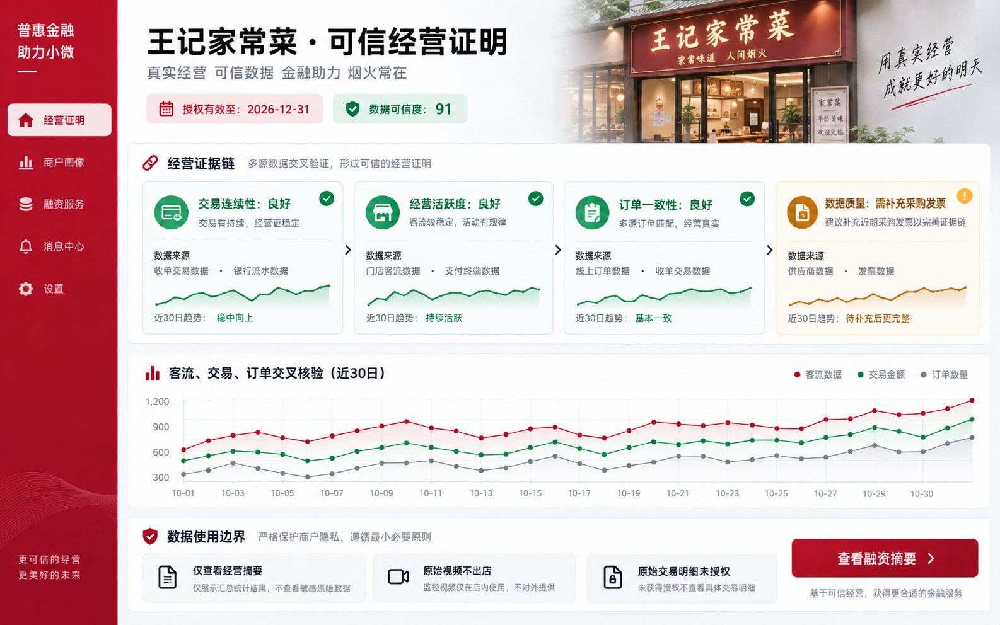

| 编号 | 功能 | 需求说明 | 优先级 |
|---|---|---|---|
| CE-01 | 证据链总览 | 同屏展示交易连续性、经营活跃度、订单一致性和数据质量四类证据 | P0 |
| CE-02 | 证据详情 | 每项证据均展示数据来源、覆盖周期、趋势和一致性结论 | P0 |
| CE-03 | 交叉核验趋势 | 展示客流、交易、订单在同一时间范围内的交叉趋势 | P0 |
| CE-04 | 数据使用边界 | 明确已授权字段、未授权字段及原始视频本地处理限制 | P0 |
| CE-05 | 缺口补充 | 针对采购发票、数据断档等问题生成补充材料或核验任务 | P1 |

### 数据可信度评分

可信度评分范围为0—100，仅作为数据质量及经营核验辅助，不作为单独授信结论。

```text
可信度评分 = 数据完整性 × 30%
           + 多源一致性 × 30%
           + 流水连续性 × 20%
           + 设备在线率 × 10%
           + 异常数据健康度 × 10%
```

---

## 5.3 商户端：经营看板

### 页面原型一：商户首页 / 今日经营

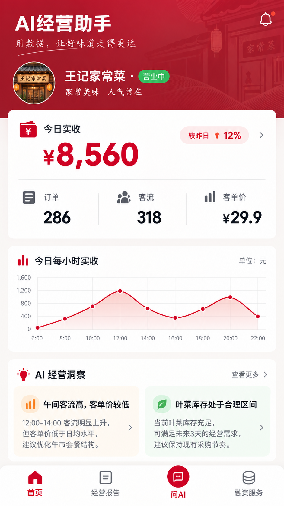

```text
┌───────────────────────────────────────────┐
│  AI经营助手                         09月13日 │
│  王记家常菜 · 营业中  ● 数据正常             │
├───────────────────────────────────────────┤
│  今日实收 ¥8,560      较昨日 +12.4%         │
│  ───────────────────────────────────────  │
│  订单 286      客流 318      客单价 ¥29.9   │
├───────────────────────────────────────────┤
│  [营收趋势]                                │
│  ¥10k ┤                         ●           │
│   ¥5k ┤              ●      ●               │
│     0 └── 10  11  12  13  14  15  16  17时   │
├───────────────────────────────────────────┤
│  今日关注                                   │
│  ⚠ 午间客流高，客单价较同类时段低 11%         │
│  ✓ 叶菜库存可支撑 2.1 天，处于合理区间         │
├───────────────────────────────────────────┤
│  [经营报告]       [问AI]       [融资服务]     │
└───────────────────────────────────────────┘
```

### 功能需求

| 编号 | 功能 | 需求说明 | 优先级 |
|---|---|---|---|
| MB-01 | 今日总览 | 展示实收、订单、客流、客单价、退款率及同比/环比 | P0 |
| MB-02 | 时段趋势 | 按小时展示客流、订单、营收及排队趋势 | P0 |
| MB-03 | 经营提醒 | 每日输出不超过3条优先级最高的经营提醒 | P0 |
| MB-04 | 数据状态 | 显示支付、外卖、摄像头、库存等数据源连接状态 | P0 |
| MB-05 | 历史对比 | 支持日、周、月、节假日同期对比 | P1 |

### 关键交互

- 首页打开后默认展示“今天”；点击任一指标进入对应分析页。
- 异常卡片必须说明“发现了什么、可能原因、建议操作”。
- 商户可标记建议为“已执行”“暂不适用”“我有疑问”，形成AI建议反馈闭环。

---

## 5.4 商户端：AI经营顾问

### 页面原型二：AI经营建议

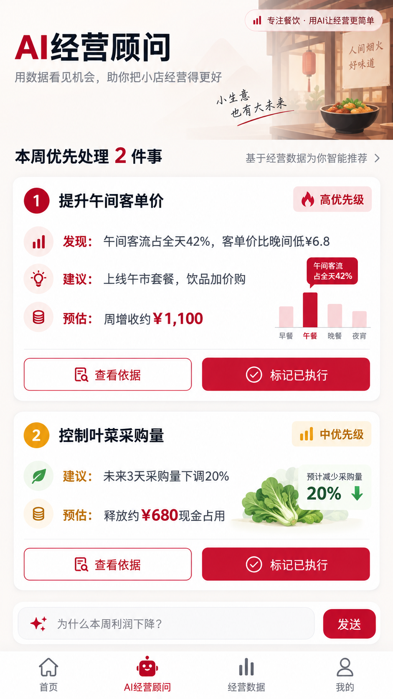

```text
┌───────────────────────────────────────────┐
│  ← AI经营顾问                              │
│  本周优先处理 2 件事                        │
├───────────────────────────────────────────┤
│  ① 提升午间客单价                    高优先级 │
│  发现：11:30—13:00客流占全天42%，             │
│       客单价比晚间低¥6.8。                    │
│  建议：上线“主食+小菜+饮品”午市套餐，          │
│       饮品采用加价购。                        │
│  预估：若转化率达到15%，周增收约¥1,100。       │
│  [查看依据] [标记已执行]                     │
├───────────────────────────────────────────┤
│  ② 控制叶菜采购量                    中优先级 │
│  发现：叶菜周转天数从2.4天升至4.8天。          │
│  建议：未来3天采购量下调20%，优先消化库存。     │
│  预期：释放约¥680现金占用，降低损耗。           │
│  [查看依据] [稍后处理]                       │
├───────────────────────────────────────────┤
│  你可以问：为什么本周利润下降？                │
│  ┌───────────────────────┐ [发送]           │
│  └───────────────────────┘                  │
└───────────────────────────────────────────┘
```

### AI建议生成规范

每条建议必须包括：

1. **发现**：明确异常或机会，包含关键指标和时间范围；
2. **依据**：展示关联数据，例如“客流上涨但客单价下降”；
3. **行动**：不超过3个可执行动作；
4. **预期**：预估对营收、利润、库存或现金流的影响范围；
5. **风险提示**：说明适用条件和可能的副作用；
6. **反馈入口**：供商户记录执行情况，优化后续建议。

| 编号 | 功能 | 需求说明 | 优先级 |
|---|---|---|---|
| AC-01 | 主动建议 | 基于异常、趋势与目标生成日/周经营建议 | P0 |
| AC-02 | 问答分析 | 支持商户以自然语言追问“为什么利润下降” | P1 |
| AC-03 | 建议解释 | 展示建议引用的经营数据、时间范围与计算依据 | P0 |
| AC-04 | 方案模拟 | 展示套餐、采购量或营业时段调整后的预估结果 | P1 |
| AC-05 | 采纳反馈 | 支持已执行、暂不适用、效果反馈 | P1 |

### 建议优先级规则

| 优先级 | 触发条件 | 示例 |
|---|---|---|
| 高 | 影响现金流、重大成本或潜在经营风险 | 库存临期、连续营收下滑、现金缺口 |
| 中 | 影响利润率或运营效率 | 客单价下降、外卖毛利变低、排队过长 |
| 低 | 增长机会或优化建议 | 菜品组合优化、会员促销、营业时段微调 |

### 建议效果闭环

AI经营建议的价值不以“生成数量”衡量，而以商户采纳后的实际改善衡量。


V1高频建议仅聚焦三类：午间套餐/客单价优化、外卖满减与毛利优化、库存/采购节奏优化。只有在接入采购与库存数据后，系统才生成库存类建议。

---

## 5.5 商户端：融资服务

### 页面原型三：融资画像与申请

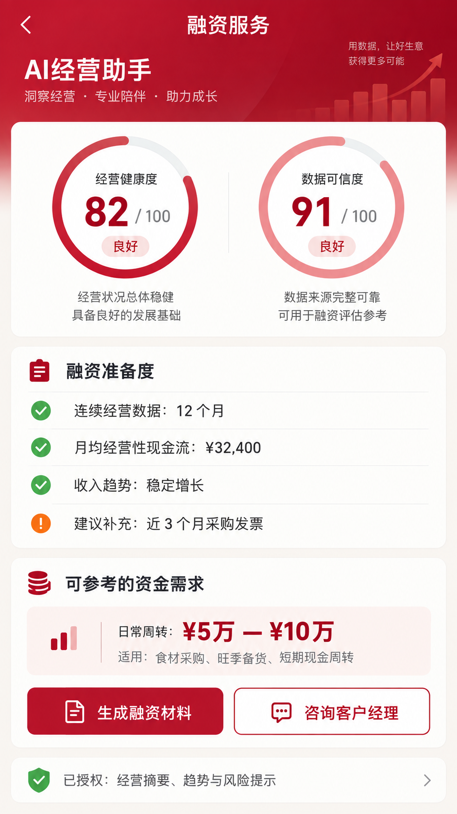

```text
┌───────────────────────────────────────────┐
│  ← 融资服务                                │
│  经营健康度 82 / 100             良好        │
│  数据可信度 91 / 100             较高        │
├───────────────────────────────────────────┤
│  融资准备度                                 │
│  ✓ 连续经营数据：12个月                     │
│  ✓ 月均经营性现金流：¥32,400                 │
│  ✓ 收入趋势：稳定增长                        │
│  ! 建议补充：近3个月采购发票                 │
├───────────────────────────────────────────┤
│  可参考的资金需求                            │
│  日常周转：¥5万—¥10万                         │
│  适用：食材采购、旺季备货、短期现金周转        │
│  [生成融资材料]  [咨询客户经理]               │
├───────────────────────────────────────────┤
│  数据授权                                    │
│  已授权：经营摘要、趋势与风险提示             │
│  未授权：原始交易明细、原始视频               │
│  [管理授权范围]                              │
└───────────────────────────────────────────┘
```

| 编号 | 功能 | 需求说明 | 优先级 |
|---|---|---|---|
| FS-01 | 经营健康度 | 汇总营收稳定性、利润、库存、现金流和经营活跃度 | P0 |
| FS-02 | 数据可信度 | 展示数据质量评分、扣分项和补充建议 | P0 |
| FS-03 | 融资准备度 | 提示已有材料、缺失材料与可改善项 | P0 |
| FS-04 | 融资材料生成 | 自动生成经营摘要、现金流预测、经营证明和材料清单 | P0 |
| FS-05 | 授权管理 | 可按数据类型、用途、有效期管理银行访问授权 | P0 |
| FS-06 | 产品匹配 | 基于资金用途和经营状态推荐适配金融产品 | P1 |

### 融资服务原则

- “经营健康度”和“数据可信度”只用于说明经营材料完整度与稳定性，不构成授信承诺；
- 页面优先展示“是否具备申请准备条件、还缺什么材料、下一步找谁”，而非夸大额度预测；
- 任何建议授信区间仅向有权人员展示，且明确标注“需经银行人工审批”。

### 融资画像字段

| 模块 | 输出内容 |
|---|---|
| 基础经营 | 行业、营业时长、经营年限、门店规模、渠道结构 |
| 经营规模 | 近6/12个月营收、订单、客流、客单价趋势 |
| 经营效率 | 毛利估算、成本率、库存周转、退款率、排队效率 |
| 现金流与还款能力 | 经营性净现金流、波动区间、未来30天预测 |
| 可信度 | 数据完整性、多源一致性、设备在线率、异常提示 |
| 风险与改善 | 主要风险信号、商户已执行的改善动作、AI建议 |

### 页面原型：融资材料包与授权确认

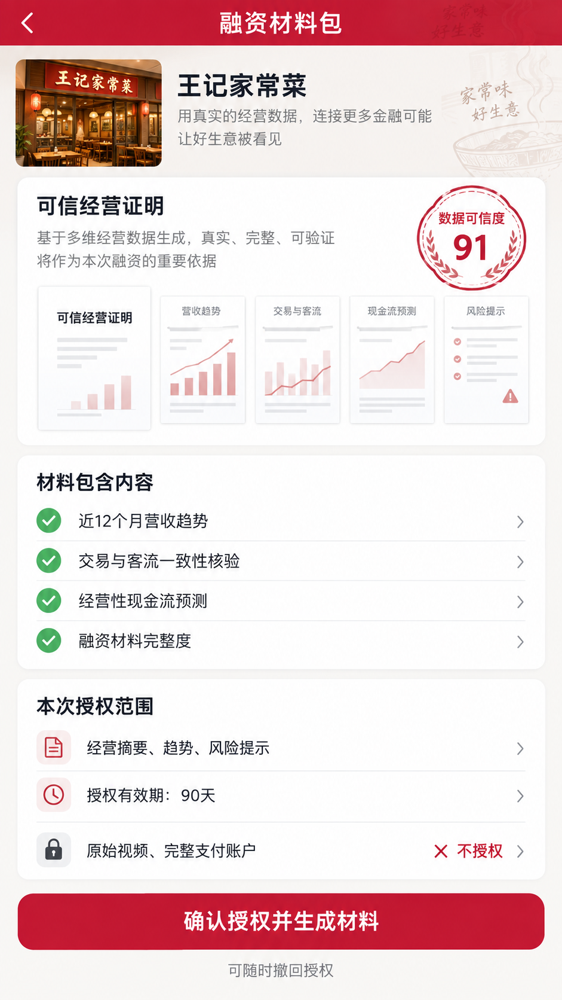

| 编号 | 功能 | 需求说明 | 优先级 |
|---|---|---|---|
| FM-01 | 材料预览 | 展示可信经营证明、营收趋势、交叉核验、现金流预测和完整度等材料目录 | P0 |
| FM-02 | 范围确认 | 商户在生成前确认本次向银行共享的数据类型、目的和授权有效期 | P0 |
| FM-03 | 敏感数据提示 | 明确“原始视频、完整支付账户”等敏感数据不在授权范围内 | P0 |
| FM-04 | 可撤回授权 | 授权成功后提供查看、变更与撤回入口；撤回后停止后续访问 | P0 |
| FM-05 | 生成与留痕 | 生成材料包时记录商户、接收方、字段范围、用途、时间和版本 | P0 |

---

## 5.6 银行端：商户经营画像

### 页面原型：客户经理商户服务工作台

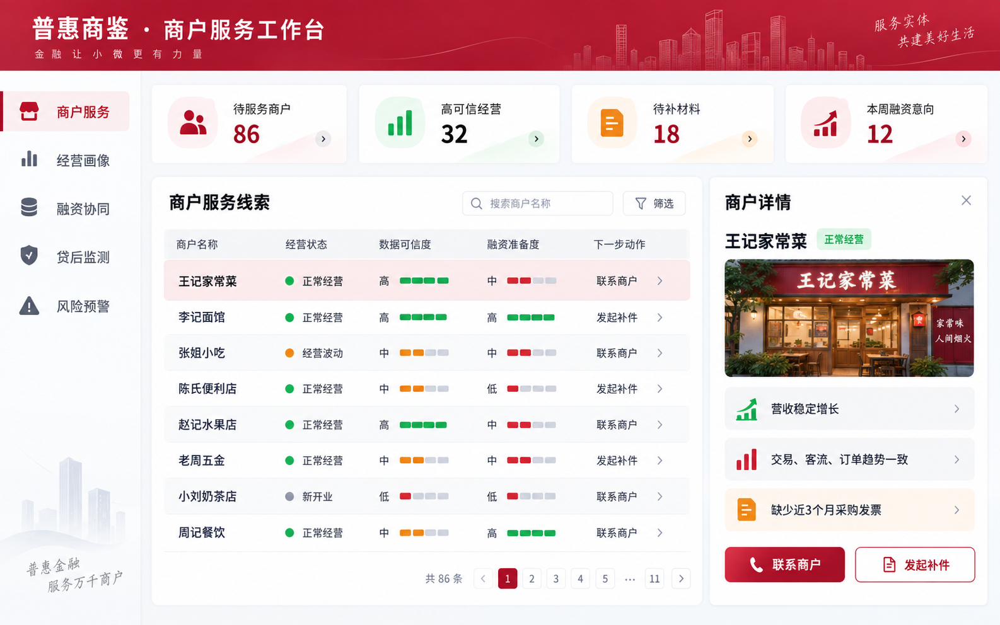

| 编号 | 功能 | 需求说明 | 优先级 |
|---|---|---|---|
| CL-01 | 商户服务线索池 | 汇总待服务商户、高可信经营商户、待补材料商户及融资意向商户 | P0 |
| CL-02 | 优先级排序 | 支持按可信度、融资准备度、经营趋势、待处理时间排序 | P0 |
| CL-03 | 下一步动作 | 支持直接发起联系、开通邀请、补件请求和经营画像查看 | P0 |
| CL-04 | 任务协同 | 记录客户经理跟进状态、联系结果、下次跟进时间和负责人 | P1 |
| CL-05 | 合规展示 | 列表只展示经授权的经营摘要及必要线索，不展示原始敏感明细 | P0 |

### 页面原型四：银行客户经理工作台

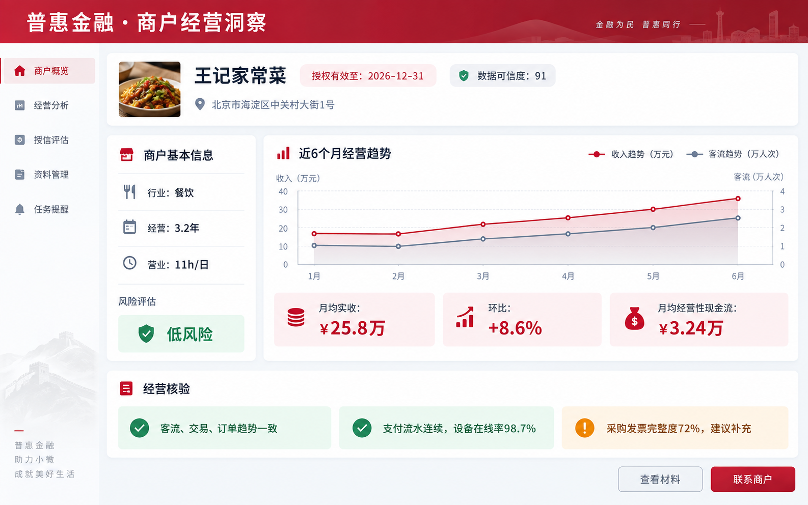

```text
┌─────────────────────────────────────────────────────────────┐
│  工行普惠金融 · 商户经营洞察                                  │
│  商户：王记家常菜   授权有效至：2026-12-31  数据可信度：91      │
├──────────────┬──────────────────────────────────────────────┤
│ 商户摘要      │ 近6个月经营趋势                               │
│ 行业：餐饮    │ 营收  ▁▂▃▃▄▅   客流  ▁▂▂▃▄▅                  │
│ 经营：3.2年   │ 月均实收：¥25.8万   环比：+8.6%               │
│ 营业：11h/日  │ 月均经营性现金流：¥3.24万                     │
│              ├──────────────────────────────────────────────┤
│ 风险信号      │ 经营核验                                      │
│ ● 低风险      │ ✓ 客流、交易、订单趋势一致                    │
│ 近30日无重大  │ ✓ 支付流水连续，设备在线率98.7%               │
│ 异常          │ ! 采购发票完整度72%，建议补充                 │
│              ├──────────────────────────────────────────────┤
│ [查看材料]    │ 建议动作                                      │
│ [联系商户]    │ 适合进入授信评估；建议额度仅供审批辅助参考     │
└──────────────┴──────────────────────────────────────────────┘
```

### 银行端功能需求

| 编号 | 功能 | 需求说明 | 优先级 |
|---|---|---|---|
| BK-01 | 商户列表 | 按行业、区域、融资需求、风险等级、数据可信度筛选 | P0 |
| BK-02 | 经营画像 | 展示授权范围内的商户经营摘要、趋势及可信度 | P0 |
| BK-03 | 交叉核验 | 呈现客流、交易、订单、采购与库存间的一致性结论 | P0 |
| BK-04 | 授信辅助 | 展示建议关注项、材料缺口和建议授信区间，仅供人工决策参考 | P0 |
| BK-05 | 材料导出 | 生成标准化尽调摘要与融资材料包 | P1 |
| BK-06 | 客户经理协同 | 支持记录跟进、联系商户、发起补充材料请求 | P1 |

### 客户经理业务动作闭环

| 阶段 | 系统输出 | 客户经理动作 | 商户获得的服务 |
|---|---|---|---|
| 获客 | 高可信度、具备资金需求特征的商户线索 | 邀约开通或发起服务触达 | 获得经营诊断与融资准备度检查 |
| 贷前 | 可信经营证明、材料缺口、经营趋势 | 补件、尽调、推荐匹配产品 | 减少重复提交流水和证明材料 |
| 贷中 | 资金用途提示、现金流趋势 | 结合银行既有流程人工审批 | 获得清晰的下一步和产品说明 |
| 贷后 | 异常信号、经营变化、建议执行效果 | 回访、核验、经营帮扶、动态复评 | 获得风险提示和经营改善建议 |

该模块的目标不是取代客户经理，而是将客户经理从“收集截图、人工拼报表”中释放出来，转向“识别、服务和帮扶”。

---

## 5.7 网页端：商户经营总览与贷后预警中心

网页端适合商户老板在电脑上进行周/月经营复盘，也适合银行客户经理和风控人员进行多商户管理、资料审核及贷后监测。移动端突出“快速看数、立即行动”，网页端突出“全局分析、横向对比和协同处理”。

### 页面原型五：商户网页端 / 经营总览

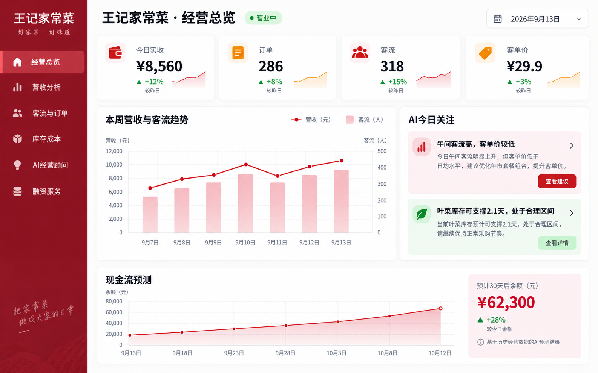

| 编号 | 功能 | 需求说明 | 优先级 |
|---|---|---|---|
| WB-01 | 多周期经营复盘 | 支持日、周、月和自定义时间段的营收、客流、订单、客单价趋势查看 | P0 |
| WB-02 | 多维经营分析 | 在同一页面联动查看渠道收入、时段表现、菜品/品类贡献、库存成本及现金流预测 | P0 |
| WB-03 | AI待办中心 | 集中展示高、中、低优先级建议，以及商户的采纳和效果反馈 | P1 |
| WB-04 | 报表导出 | 支持导出经营日报、周报、月报和融资材料预览 | P1 |

### 页面原型六：银行网页端 / 贷后预警中心

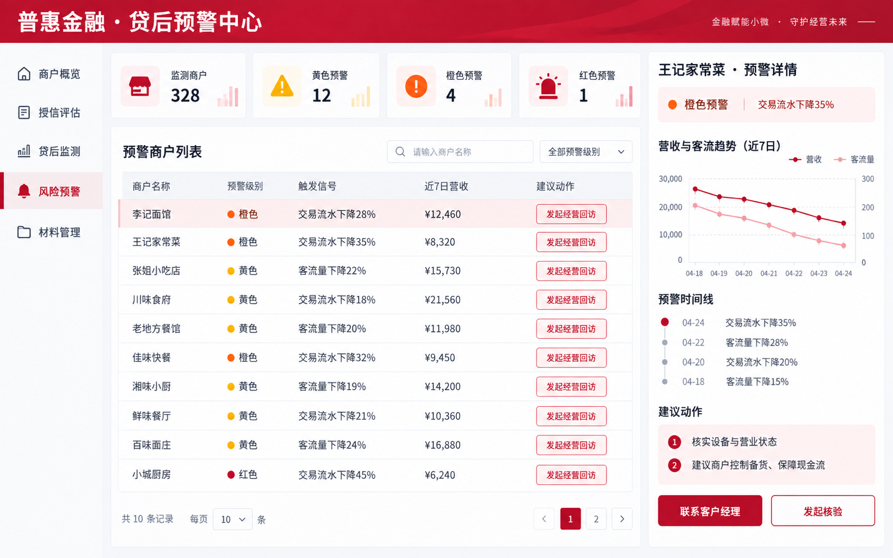

| 编号 | 功能 | 需求说明 | 优先级 |
|---|---|---|---|
| WB-05 | 风险概览 | 汇总所辖商户数、各级预警数量、待处理事项和趋势变化 | P0 |
| WB-06 | 预警商户列表 | 支持按预警级别、行业、区域、客户经理和触发信号筛选排序 | P0 |
| WB-07 | 预警详情 | 展示触发依据、经营趋势、多源核验结果、历史预警及建议动作 | P0 |
| WB-08 | 处置留痕 | 支持发起核验、联系客户经理、记录回访结论和关闭预警 | P0 |
| WB-09 | 商户帮扶建议 | 预警详情中同步展示可向商户提供的经营改善建议 | P1 |

---

## 5.8 银行端：贷后监测与预警

### 预警分级

| 级别 | 触发样例 | 银行建议动作 | 商户侧同步建议 |
|---|---|---|---|
| 黄色 | 连续两周营收或客流下降；库存周转变慢 | 客户经理关注、核实原因 | 调整备货、观察客流变化 |
| 橙色 | 交易明显下滑；退款率异常；成本快速上升 | 发起经营回访、补充分析 | 控制成本、优化促销、保障现金流 |
| 红色 | 持续无交易；停业迹象；严重现金流缺口 | 风控介入、启动人工核验 | 提示商户联系客户经理并制定恢复计划 |

### 贷后闭环

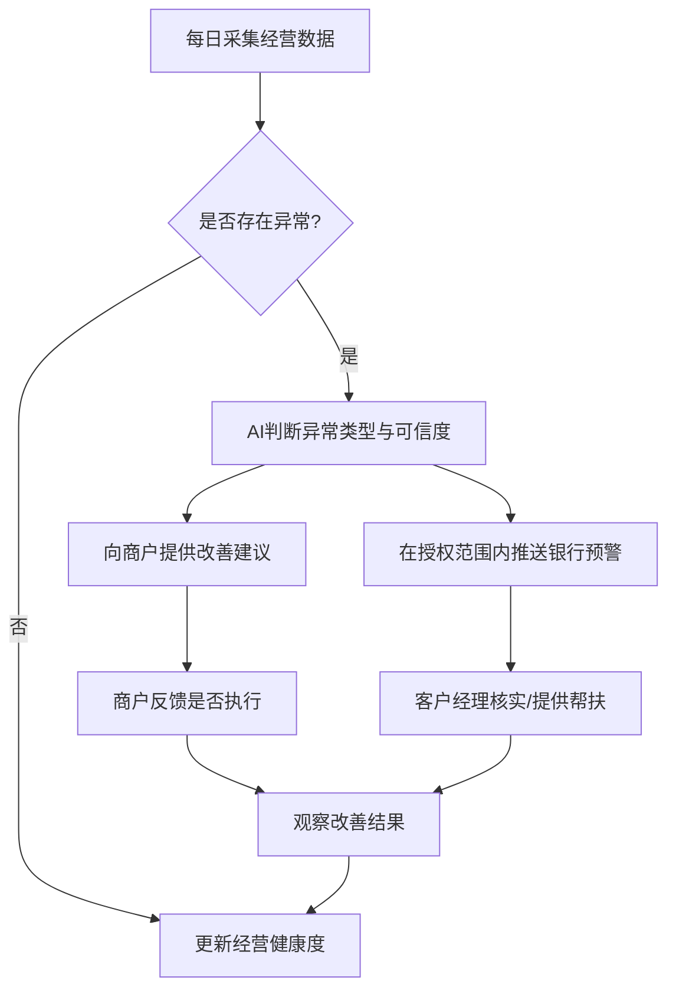

---

## 6. 核心指标与计算口径

| 指标 | 口径 | 用途 |
|---|---|---|
| 日实收 | 支付、POS、外卖等渠道实收之和，扣除退款 | 经营规模 |
| 客单价 | 实收金额 ÷ 有效订单数 | 定价与套餐优化 |
| 客流转化率 | 有效交易订单数 ÷ 进店客流 | 服务与销售效率 |
| 毛利率（估算） | （销售额－食材及直接成本）÷ 销售额 | 盈利能力 |
| 库存周转天数 | 平均库存成本 ÷ 日均销售成本 | 库存效率与现金占用 |
| 经营性现金流 | 营业收入流入－采购、人工、租金等经营支出 | 偿债能力辅助判断 |
| 营收稳定性 | 按周/月营收波动、趋势、季节性综合计算 | 授信及风险辅助 |
| 数据可信度 | 完整性、一致性、连续性、设备在线率、异常率加权 | 数据质量辅助 |

---

## 7. AI能力设计

### 7.1 AI输入、推理与输出

| 环节 | 内容 |
|---|---|
| 输入 | 客流、排队、营业时长、交易、订单、采购、库存、发票等脱敏数据 |
| 分析 | 时间序列趋势、异常检测、多源一致性验证、行业基准对比、现金流预测 |
| 输出 | 经营报表、问题诊断、行动建议、融资材料、贷后预警 |
| 人工约束 | 经营建议由商户自主选择；融资及授信结论必须由银行人工审批 |

### 7.2 AI建议模板

```text
【问题】午间客单价低于近四周均值11%
【依据】11:30—13:00客流占全天42%，但套餐购买率仅18%
【建议】推出高毛利套餐；设置饮品加价购；在点餐页优先展示套餐
【预期】在不降低客流的前提下，客单价提升3%—6%
【注意】活动上线后观察7天，若退款率或差评上升，及时调整
```

### 7.3 建议质量要求

- 不得只输出“提高销量”“降低成本”等空泛结论；
- 不得将相关性直接表述为因果关系；
- 对数据不足或可信度低的结论，必须标记“建议补充数据后判断”；
- 对融资、还款等金融事项，只能做匹配与风险提示，不得承诺授信结果；
- 每条建议都应可追溯到数据来源、时间范围和触发规则。

---

## 8. 权限、隐私与合规

### 8.1 权限原则

1. 商户知情、明确授权、可随时查看与管理授权；
2. 最小必要原则：银行默认查看经营摘要，不默认查看原始明细；
3. 摄像头只统计经营活跃度，不采集或传输顾客可识别信息；
4. 数据本地脱敏、传输加密、云端分级存储；
5. 全量记录数据访问、导出与授权变更日志。

### 8.2 数据分级

| 数据级别 | 示例 | 默认处理 |
|---|---|---|
| 一级：经营摘要 | 月营收、客流趋势、库存周转、风险标签 | 经商户授权后可供银行查看 |
| 二级：经营明细 | 按日渠道流水、订单结构、采购明细 | 需单独授权、按用途和有效期控制 |
| 三级：敏感原始数据 | 顾客影像、完整支付账号、联系方式 | 默认不采集或仅本地处理，不向银行提供 |

---

## 9. 非功能需求

| 类别 | 要求 |
|---|---|
| 易用性 | 商户端核心页面适配手机；首次上手无需财务知识 |
| 时效性 | 营收、客流等核心指标小时级更新；日结报表次日10:00前生成 |
| 稳定性 | 数据盒子网络中断可本地缓存，恢复后自动续传 |
| 安全性 | 本地与云端加密；权限分级；关键操作留痕 |
| 可解释性 | 经营建议、风险预警、评分均展示主要依据 |
| 可扩展性 | 支持后续接入更多支付渠道、ERP、银行产品与行业模型 |

---

## 10. MVP版本规划

| 阶段 | 目标 | 核心交付 |
|---|---|---|
| V1：可信经营证明 | 证明数据可用、可验证、可授权 | 工行收单/POS、客流、外卖订单接入；本地脱敏；可信度核验；商户看板；银行经营摘要 |
| V2：经营改善 | 验证AI建议能改善经营 | 高频异常检测；套餐/外卖/备货三类建议；执行反馈与效果复盘；采购库存轻量录入 |
| V3：精准融资服务 | 打通贷前服务与材料协同 | 融资准备度、材料生成、授权管理、客户经理补件和经营画像工作台 |
| V4：贷后陪伴与复评 | 实现“预警 + 帮扶 + 复评”闭环 | 现金流预测、贷后预警、处置留痕、经营帮扶建议、动态复评 |

---

## 11. 成功衡量指标

| 维度 | 指标 | 首期目标示例 |
|---|---|---|
| 商户覆盖 | 数据盒子激活率 | ≥ 85% |
| 数据质量 | 核心数据源接入完成率 | ≥ 80% |
| 使用价值 | 周经营报告查看率 | ≥ 60% |
| 建议价值 | AI建议采纳率 | ≥ 25% |
| 融资效率 | 商户尽调材料准备时长 | 较传统流程缩短50% |
| 风控价值 | 预警提前识别天数 | 较还款逾期前提前14天以上 |
| 经营改善 | 接入商户库存周转改善率 | 试点商户平均改善10%以上 |

### 11.1 MVP试点验证

建议选择**30家已有工行收单关系的社区餐饮商户**进行为期90天的试点。试点重点验证四件事：

1. 交易、客流和外卖订单能否稳定接入，并形成高可信度经营画像；
2. 客户经理准备一份经营摘要的时间能否明显降低；
3. 商户是否会采纳AI建议，以及采纳后客单价、库存周转或现金流是否改善；
4. 贷后异常能否在人工发现前被提前识别并完成帮扶。

---

## 12. 商业与推广路径

| 阶段 | 推广方式 | 价值验证 |
|---|---|---|
| 试点 | 与工行支行、收单商户及本地餐饮服务商联合试点 | 验证数据接入、客户经理效率和商户使用价值 |
| 复制 | 面向同城餐饮商圈及工行存量小微客户推广 | 形成行业模板和标准化设备部署流程 |
| 扩展 | 扩展便利店、零售店、生活服务门店 | 复用可信经营证明框架，增加行业特征模型 |

成本与收益应由银行、设备/系统合作方及商户共同承担：银行获得获客、尽调和贷后效率；商户获得经营诊断及融资服务；平台获得设备运维、数据治理和SaaS服务的可持续收入空间。

---

## 13. 项目亮点（工行杯答辩可直接使用）

1. **从“看流水”到“可信经营证明”**：以交易、客流、订单等相互验证，让银行不仅看到流水，更能判断流水背后的真实经营。
2. **从“风控监测”到“经营改善型普惠金融”**：AI不只提示风险，更向商户提供可执行建议，增强现金流与还款能力。
3. **从“一次性尽调”到“动态普惠服务”**：贯通获客、补件、授信辅助、贷后预警、客户经理帮扶和动态复评。
4. **从“功能堆叠”到“最小可行落地”**：V1以工行收单/POS、客流和外卖订单建立最小可信数据组合，降低接入与试点成本。
5. **从“黑箱AI”到“可解释AI”**：每项评分、建议和预警均显示数据来源、时间范围、触发逻辑和改善效果。
6. **兼顾金融效率与数据安全**：原始视频不出店、最小授权、数据分级和全过程审计，降低隐私与合规风险。

## 14. 待确认事项

- 首期试点能否优先获取工行收单/POS流水，并由商户补充其他支付渠道的汇总数据？
- 摄像头是否由银行/合作方统一提供，还是支持接入现有设备？
- 融资材料是否需要与工行现有普惠贷款产品及审批系统打通？
- 首期试点是否限定某个城市、某类餐饮商户或某个支行？
- “建议授信区间”采用规则引擎、评分模型，还是仅作为客户经理参考信息？
