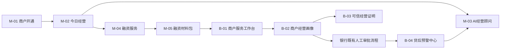
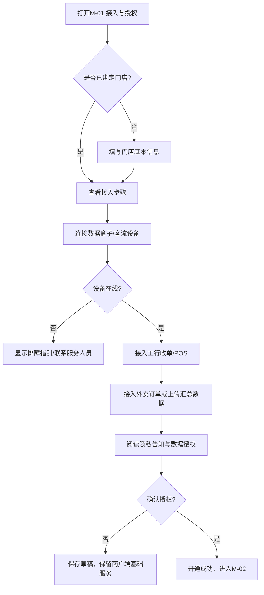
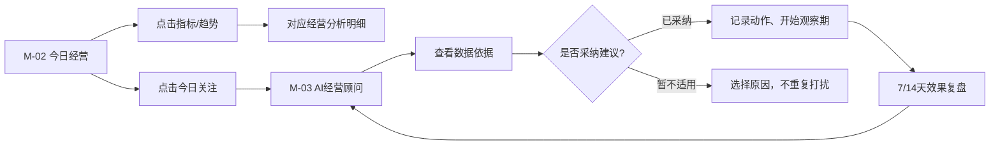
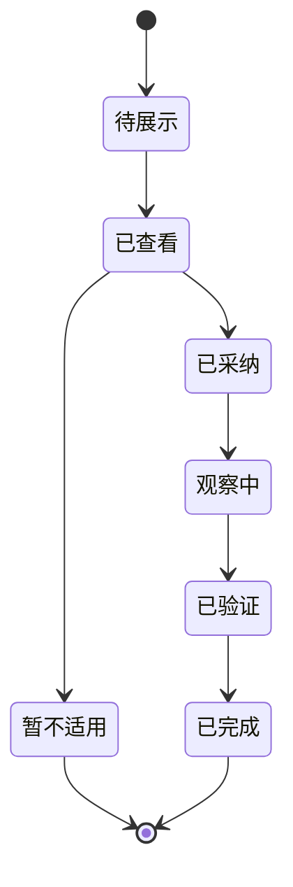
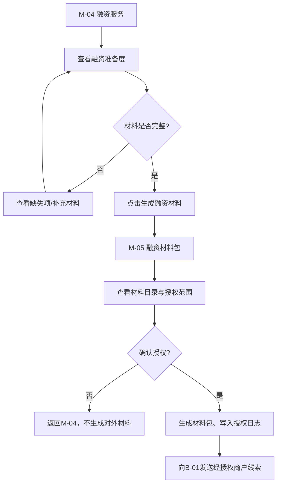
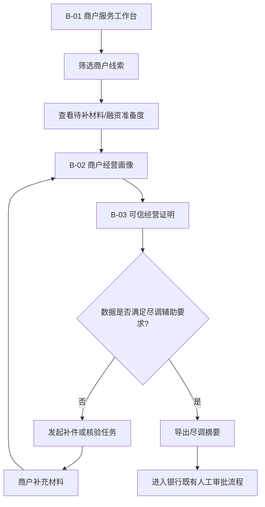
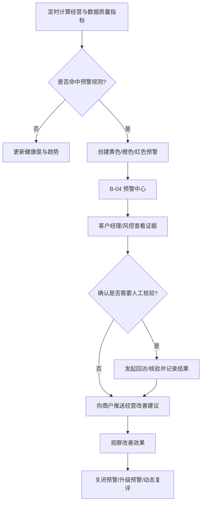

# 普惠商鉴：用户流程与页面跳转说明

> **版本**：V1.0  
> **用途**：作为产品、设计与开发联调依据。本文定义V1用户主路径、页面跳转、关键状态和异常处理；原型视觉稿见《AI经营数据盒子_PRD.md》。

---

## 1. 页面清单

| 页面ID | 端 | 页面名称 | 对应原型 | 核心任务 |
|---|---|---|---|---|
| M-01 | 商户移动端 | 接入与授权 | 商户端-接入与授权.png | 连接设备和数据源，完成首次服务授权 |
| M-02 | 商户移动端 | 今日经营 | 商户端-今日经营.png | 快速了解营收、客流、订单和待处理问题 |
| M-03 | 商户移动端 | AI经营顾问 | 商户端-AI经营顾问.png | 查看建议、证据和采纳后的效果 |
| M-04 | 商户移动端 | 融资服务 | 商户端-融资服务.png | 查看融资准备度、经营健康度和数据授权 |
| M-05 | 商户移动端 | 融资材料包 | 商户端-融资材料包.png | 确认分享范围并生成融资材料 |
| W-01 | 商户网页端 | 经营总览 | 商户网页端-经营总览.png | 周/月复盘、导出经营报告 |
| B-01 | 银行网页端 | 商户服务工作台 | 银行端-商户服务工作台.png | 管理商户线索、补件和客户经理任务 |
| B-02 | 银行网页端 | 商户经营画像 | 银行端-商户经营画像.png | 查看授权范围内的经营趋势与融资辅助信息 |
| B-03 | 银行网页端 | 可信经营证明 | 银行端-可信经营证明.png | 查看多源核验和数据使用边界 |
| B-04 | 银行网页端 | 贷后预警中心 | 银行网页端-贷后预警中心.png | 处置预警、回访和动态复评 |

---

## 2. 端到端主流程

### 主流程成功条件

1. 商户已完成至少工行收单/POS、客流设备和外卖订单中的核心数据接入。
2. 商户明确确认数据用途、授权对象和有效期。
3. 系统生成可信经营证明；若数据不足，应生成补充任务而非虚构结论。
4. 银行仅能访问商户已授权的字段范围。
5. 放款后预警必须由客户经理/风控人员人工处置，不自动触发授信动作。

---

## 3. 商户端流程

## 3.1 首次开通、接入与授权

| 当前页面 | 用户动作 | 跳转/结果 | 必填校验 |
|---|---|---|---|
| M-01 | 绑定门店 | 留在M-01，显示门店信息 | 门店名称、地址、联系人需完整 |
| M-01 | 连接设备 | 设备状态变为“已连接” | 设备序列号、在线心跳正常 |
| M-01 | 接入工行收单/POS | 数据源状态变为“已连接” | 完成商户授权或模拟环境绑定 |
| M-01 | 暂不授权 | 保存草稿 | 不开放银行端查看权限 |
| M-01 | 确认开通 | 进入M-02 | 至少一个核心交易源和客流设备可用；已阅读隐私告知 |

### 异常与降级

- 设备离线：允许先完成资料录入；首页展示“客流数据暂不可用”。
- 外卖未接入：保留堂食与收单分析；可信度评分扣减“订单完整性”项。
- 商户拒绝银行授权：可使用经营看板和AI建议；不得出现在银行服务工作台。

---

## 3.2 日常经营与AI建议

| 当前页面 | 用户动作 | 跳转/结果 | 记录数据 |
|---|---|---|---|
| M-02 | 点击营收、客流、订单指标 | 进入对应时间趋势明细 | 选择时间范围、指标类型 |
| M-02 | 点击经营提醒 | 进入M-03并定位该建议 | 建议ID、打开时间 |
| M-03 | 查看依据 | 展开触发指标、比较基线与时间范围 | 建议查看行为 |
| M-03 | 标记已执行 | 创建建议执行记录 | 建议ID、执行时间、动作说明 |
| M-03 | 暂不适用 | 关闭当前建议 | 暂不适用原因 |
| M-03 | 查看效果 | 展示观察期前后指标变化 | 评估窗口、实际改善值 |

### 建议状态机

---

## 3.3 融资服务与材料授权

| 当前页面 | 用户动作 | 跳转/结果 | 关键限制 |
|---|---|---|---|
| M-04 | 查看融资准备度 | 展开缺失材料和改善建议 | 不显示“保证获贷”内容 |
| M-04 | 生成融资材料 | 进入M-05 | 需先完成数据质量校验 |
| M-05 | 修改授权字段 | 更新授权范围预览 | 原始视频、完整支付账号不可授权 |
| M-05 | 确认授权并生成 | 创建材料包与银行线索 | 记录用途、接收方、有效期、材料版本 |
| M-05 | 撤回授权 | 停止新访问 | 不删除已发生的合规审计日志 |

---

## 4. 银行端流程

## 4.1 贷前客户经理服务流程

| 当前页面 | 客户经理动作 | 跳转/结果 | 权限控制 |
|---|---|---|---|
| B-01 | 筛选商户 | 更新线索列表 | 仅展示本人/辖区范围内商户 |
| B-01 | 联系商户 | 创建跟进任务 | 记录联系时间和结果 |
| B-01 | 发起补件 | 向商户发送补充请求 | 仅可请求商户授权范围外的补充材料，不直接访问敏感原始数据 |
| B-02 | 查看经营画像 | 查看趋势与融资准备度 | 权限不足时隐藏明细 |
| B-03 | 查看可信经营证明 | 查看数据证据链和使用边界 | 原始视频、完整账户信息始终不可见 |
| B-02 | 导出尽调摘要 | 生成带版本和水印的摘要 | 需记录导出人与用途 |

## 4.2 贷后预警与帮扶流程

| 预警状态 | 可执行动作 | 关闭条件 |
|---|---|---|
| 新建 | 查看证据、分配负责人、联系商户 | 不可直接关闭，需填写处置结论 |
| 核验中 | 回访、补充材料、标记设备故障 | 已获得核验结果或转入商户帮扶 |
| 帮扶观察中 | 向商户推送建议、设置观察期 | 观察期结束且指标改善/风险解除 |
| 已关闭 | 查看处置记录 | 仅允许补充说明，不能修改原始日志 |
| 已升级 | 提交至更高风险处置流程 | 由有权人员完成后续操作 |

---

## 5. 全局页面与交互规则

| 规则 | 说明 |
|---|---|
| 时间范围 | 默认展示“今天”或“近30日”；切换后页面内趋势、提示和导出内容必须同步刷新。 |
| 数据新鲜度 | 每页显示最近更新时间；超过24小时未更新时显示数据延迟提示。 |
| 空状态 | 未接入数据时解释价值、提示接入步骤；不得展示虚构评分或结论。 |
| 权限不足 | 明确显示“未获商户授权/当前角色无权限”，不展示敏感占位数据。 |
| 评分解释 | 点击评分必须能查看指标构成、数据周期、扣分原因和改进动作。 |
| 风险呈现 | 商户端使用“经营提醒/改善建议”语言；银行端可展示分级预警，但不得向商户暴露内部风险评级。 |
| 操作留痕 | 授权、撤回、导出、补件、预警处置和建议采纳均需记录操作人、时间、对象和结果。 |

---

## 6. V1验收主路径

1. 商户在M-01完成设备、工行收单/POS和外卖订单接入，并确认授权。
2. M-02展示可更新的营收、客流、订单和至少一条有数据依据的经营提醒。
3. 商户在M-03采纳一条建议，系统在观察期后可呈现效果对比。
4. 商户在M-05确认授权范围后生成融资材料包；B-01出现对应商户线索。
5. 客户经理从B-01进入B-02和B-03，能查看经营摘要、可信证据与数据使用边界。
6. 模拟经营下滑后，B-04生成预警；客户经理完成核验、帮扶或关闭处置的全过程留痕。
